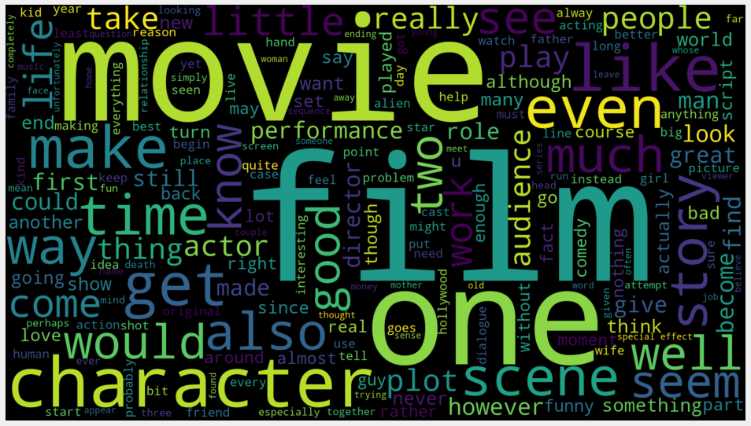

# Tweet-Sentiment-Analysis



In This Tutorials You will learn how to Analyze imdb review dataset.</br>

## Table of Contents

1. Load imdb dataset
2. Wordclould
3. Text Preprocessing
4. Machine Learning Models

To download corpus from nltk:</br>
```nltk.download()```
</br></br>for example to download movie_reviews write below command in jupyter notebook:</br>
```nltk.download("movie_reviews")```


